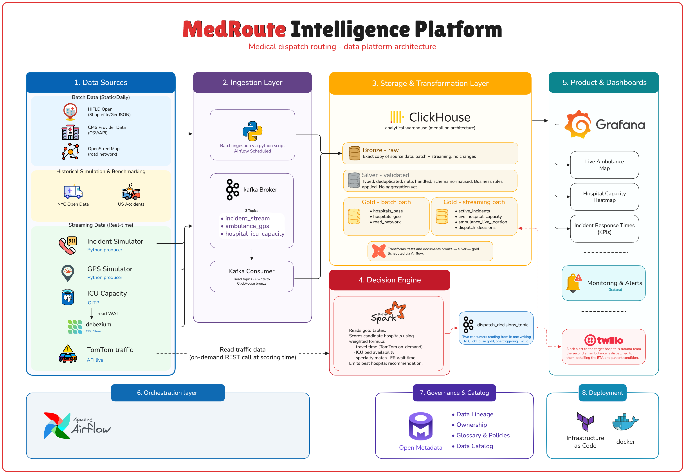

# MedRoute Intelligence Platform

Traditional emergency dispatch systems route ambulances to the _geographically closest_ hospital. However, this often leads to critical failures: the closest hospital might have a full Intensive Care Unit (ICU), or it may lack a specialized surgeon (e.g., a neurosurgeon for a severe head trauma).

**MedRoute Intelligence** solves this by building a real-time data platform that ingests live crash data, traffic congestion, and live hospital resource capacities. A smart orchestrator then dispatches the ambulance via the fastest traffic route to the **most optimal and prepared** hospital, saving lives when every second counts.

---

## Table of Contents

- [Overview](#overview)
- [Architecture](#architecture)
- [Data Sources](#data-sources)
- [Layer-by-Layer Breakdown](#layer-by-layer-breakdown)
  - [1. Ingestion Layer](#1-ingestion-layer)
  - [2. Storage & Transformation Layer](#2-storage--transformation-layer)
  - [3. Decision Engine](#3-decision-engine)
  - [4. Product & Dashboards](#4-product--dashboards)
- [Tech Stack](#tech-stack)
- [Data Flow](#data-flow)
- [Project Structure](#project-structure)
- [Getting Started](#getting-started)
- [Orchestration](#orchestration)
- [Governance & Catalog](#governance--catalog)
- [Deployment](#deployment)

---

## Overview

When a 911 call comes in, every second matters. MedRoute is a data platform that continuously ingests real-time ambulance positions, hospital ICU capacity, live traffic conditions, and active incident data — then uses a weighted scoring algorithm to recommend the best hospital for each patient, considering travel time, bed availability, specialty match, and current ER load.

The platform is built on a modern data stack that separates concerns clearly: raw ingestion, analytical storage with a medallion architecture, a Spark-powered decision engine, and Grafana dashboards for operators and analysts.


## Architecture




## Data Sources

### Batch — Static / Daily

| Source | Format | Update frequency | Purpose |
|---|---|---|---|
| CMS Provider Data | CSV / API | Daily | Hospital registry, specialties, certifications |
| HIFLD Open | Shapefile / GeoJSON | Weekly | Geographic boundaries, facility locations |
| OpenStreetMap | PBF / GeoJSON | Weekly | Road network for routing calculations |

### Historical / Simulation

| Source | Format | Purpose |
|---|---|---|
| NYC Open Data | CSV | Historical incident data for simulation and benchmarking |
| US Accidents Dataset | CSV | Historical accident patterns for model validation |

### Streaming — Real-time

| Source | Type | Kafka topic | Description |
|---|---|---|---|
| Python Incident Simulator | Producer | `incident_stream` | Simulates incoming 911 calls with location and severity |
| Python GPS Simulator | Producer | `ambulance_gps` | Simulates real-time ambulance position updates |
| ICU Capacity DB (OLTP) | Debezium CDC | `hospital_icu_capacity` | Streams every INSERT/UPDATE from the ICU Postgres database via write-ahead log |

### On-demand

| Source | Pattern | Used by |
|---|---|---|
| TomTom Traffic API | REST pull at scoring time | Apache Spark pulls current traffic conditions for each candidate route during hospital scoring — not streamed continuously |


## Layer-by-Layer Breakdown

### 1. Ingestion Layer

**Batch ingestion — Python script**

A Python script scheduled by Airflow handles all static and daily sources. It connects to each source, reads new records using an incremental watermark where available, and writes raw data directly to the ClickHouse bronze layer. No transformation happens here — the data lands exactly as received.

**Streaming ingestion — Kafka**

Three Kafka topics receive real-time events from their respective producers:

- `incident_stream` — each new 911 incident as a JSON event
- `ambulance_gps` — GPS position update per ambulance every 2 seconds
- `hospital_icu_capacity` — ICU bed count changes from the operational database

**Debezium (Change Data Capture)**

The ICU Capacity database is an operational Postgres instance managed by hospital systems. We do not modify it or query it directly for analytics. Instead, Debezium reads the Postgres write-ahead log and publishes every INSERT, UPDATE, and DELETE as an event to the `hospital_icu_capacity` Kafka topic. This gives us a real-time stream of capacity changes without touching the production database.

**Kafka Consumers**

A set of consumers reads from all three Kafka topics and writes each event to the ClickHouse bronze layer. Consumers are independent per topic so that a slowdown in one does not affect the others.

---

### 2. Storage & Transformation Layer

All data — batch and streaming — flows into a single ClickHouse analytical warehouse organized using the medallion architecture.

**Why ClickHouse?**

ClickHouse is a column-oriented OLAP database. When a dashboard query aggregates millions of GPS events to compute average response times, ClickHouse reads only the columns needed and skips the rest. This makes analytical aggregations 10–50x faster than a row-oriented database like Postgres at the same data volume.

#### Bronze — raw

The exact copy of every record as it arrived. No cleaning, no transformation, no filtering. Both batch files and streaming events land here first.

- Append-only — records are never updated or deleted
- Used as the source of truth for all downstream transformations
- Enables full reprocessing if a transformation bug is found later

#### Silver — validated

Bronze data after cleaning and standardisation:

- Data types are cast to correct formats (timestamps, floats, enums)
- Duplicate records are removed
- Null values are handled according to per-field rules
- Schema is normalised across sources that represent the same concept differently
- Business rules are applied (e.g. reject GPS coordinates outside valid bounds)
- No aggregation happens here — silver is still row-level data

#### Gold — batch path

Enriched, joined reference tables built from silver batch data. Rebuilt on schedule by Airflow triggering dbt.

| Table | Description |
|---|---|
| `gold_hospitals_base` | Clean hospital registry with all attributes |
| `gold_hospitals_geo` | Hospital locations as PostGIS-compatible geometry |
| `gold_road_network` | Routable road graph from OpenStreetMap |

#### Gold — streaming path

Near-real-time operational tables updated continuously from streaming silver data. These power live dashboards and feed Spark at scoring time.

| Table | Description |
|---|---|
| `gold_active_incidents` | All currently open 911 incidents |
| `gold_live_hospital_capacity` | Current ICU bed counts per hospital |
| `gold_ambulance_live_location` | Latest GPS position per ambulance |
| `gold_dispatch_decisions` | History of all Spark-generated routing recommendations |

#### dbt

dbt manages all transformations from bronze through silver to gold. It provides:

- **Transformation**: SQL models that define every bronze → silver → gold step
- **Testing**: automated assertions (not-null, unique keys, accepted value ranges, referential integrity)
- **Documentation**: auto-generated data dictionary for every model and column
- **Lineage**: full DAG showing how every gold table traces back to its raw source

dbt runs are scheduled and triggered by Airflow.

---

### 3. Decision Engine

The decision engine fires when a new incident arrives in `gold_active_incidents`.

**Apache Spark — hospital scoring**

Spark reads from the gold tables and scores every candidate hospital within a configurable radius of the incident using a weighted formula:

```
score = w1 × (1 / travel_time)
      + w2 × icu_beds_available
      + w3 × specialty_match
      + w4 × (1 / er_wait_time)
```

Travel time is computed using TomTom's traffic API called on-demand at scoring time — Spark pulls current traffic conditions for each candidate route rather than maintaining a continuous traffic stream. This keeps Kafka clean and avoids storing traffic data that is only useful for seconds.

Spark selects the hospital with the highest score and emits the recommendation.

---

### 4. Product & Dashboards

#### A. **Twilio**

Slack alert to the target hospital's trauma team the second an ambulance is dispatched to them, detailing the ETA and patient condition.

#### B. **Grafana**

All dashboards are built in Grafana, reading from ClickHouse gold tables.

| Dashboard | Source table | Refresh |
|---|---|---|
| Live Ambulance Map | `gold_ambulance_live_location` | 2-second auto-refresh |
| Hospital Capacity Heatmap | `gold_live_hospital_capacity` | 30-second auto-refresh |
| Incident Response Times (KPIs) | `gold_dispatch_decisions` + `gold_active_incidents` | 1-minute refresh |

Grafana also handles **monitoring and alerts** — pipeline health metrics including Kafka consumer lag, dbt run success rate, Airflow DAG status, and ClickHouse query latency.


## Tech Stack

| Tool | Role | Why this tool |
|---|---|---|
| Apache Kafka | Streaming message broker | Decouples producers from consumers, durable, supports multiple independent consumers per topic |
| Debezium | Change Data Capture | Reads Postgres WAL without modifying the source database or application code |
| Python | Batch ingestion scripts | Simple, flexible, extensive connector ecosystem |
| ClickHouse | Analytical warehouse | Column-oriented storage makes aggregation queries 10–50x faster than row-oriented databases at scale |
| dbt | SQL transformation layer | Version-controlled transformations, built-in testing, automatic lineage documentation |
| Apache Spark | Decision engine compute | Distributed scoring across large candidate sets, handles complex weighted formulas, extensible to ML |
| TomTom API | Live traffic data | On-demand pull at scoring time — no need to stream and store continuously changing traffic data |
| Grafana | Dashboards and alerting | Native ClickHouse integration, strong time-series support, alerting built-in |
| Apache Airflow | Pipeline orchestration | Schedules batch ingestion and dbt runs, handles retries, provides full DAG visibility |
| OpenMetadata | Data governance and catalog | Central registry for all datasets, owners, quality scores, and lineage across the platform |
| Docker | Containerisation | Consistent environments across development and production, all services defined as code |
| Terraform | Infrastructure as code | Defines cloud resources for production deployment, version-controlled, reproducible |


## Project Structure

```
medroute-intelligence-platform/
│
├── ingestion/
│   ├── batch/
│   │   ├── cms_provider.py          # CMS data ingestion
│   │   ├── hifld_open.py            # HIFLD shapefile ingestion
│   │   └── openstreetmap.py         # OSM road network ingestion
│   └── streaming/
│       ├── incident_simulator.py    # Kafka producer — incidents
│       ├── gps_simulator.py         # Kafka producer — GPS
│       └── kafka_consumer.py        # Consumers → ClickHouse bronze
│
├── transformation/
│   └── dbt_project/
│       ├── models/
│       │   ├── bronze/              # Raw source models
│       │   ├── silver/              # Validated, cleaned models
│       │   └── gold/
│       │       ├── batch/           # hospitals_base, geo, road_network
│       │       └── streaming/       # active_incidents, live_capacity, etc.
│       ├── tests/                   # dbt data quality tests
│       └── dbt_project.yml
│
├── decision_engine/
│   ├── spark_scoring.py             # Hospital scoring job
│   ├── dispatch_api.py              # FastAPI dispatch endpoint
│   └── reverse_etl.py               # Write decisions back to Postgres
│
├── dashboards/
│   └── grafana/
│       ├── live_ambulance_map.json
│       ├── hospital_capacity.json
│       └── incident_kpis.json
│
├── orchestration/
│   └── airflow/
│       ├── dags/
│       │   ├── batch_ingestion_dag.py
│       │   └── dbt_transformation_dag.py
│       └── plugins/
│
├── governance/
│   └── openmetadata/
│       └── metadata_ingestion.yaml
│
├── docker/
│   ├── docker-compose.yml           # Full local stack
│   └── services/
│       ├── clickhouse/
│       ├── kafka/
│       ├── airflow/
│       └── grafana/
│
└── README.md
```


## Getting Started

### Prerequisites

- Docker and Docker Compose
- Python 3.11+
- dbt-clickhouse adapter

### Run the full stack locally

```bash
# Clone the repository
git clone https://github.com/your-username/medroute-intelligence-platform.git
cd medroute-intelligence-platform

# Start all services
docker compose up -d

# Verify services are running
docker compose ps
```

Services started:

| Service | Port |
|---|---|
| ClickHouse | 8123 (HTTP), 9000 (native) |
| Kafka | 9092 |
| Airflow UI | 8080 |
| Grafana | 3000 |
| OpenMetadata | 8585 |

### Run batch ingestion

```bash
cd ingestion/batch
pip install -r requirements.txt
python cms_provider.py
python hifld_open.py
python openstreetmap.py
```

### Start streaming simulators

```bash
cd ingestion/streaming
python incident_simulator.py &
python gps_simulator.py &
python kafka_consumer.py
```

### Run dbt transformations

```bash
cd transformation/dbt_project
pip install dbt-clickhouse
dbt deps
dbt run
dbt test
dbt docs generate && dbt docs serve
```

### Start the decision engine

```bash
cd decision_engine
python dispatch_api.py
# In a separate terminal:
spark-submit spark_scoring.py
```

### Open dashboards

Navigate to `http://localhost:3000` in your browser. Default credentials: `admin / admin`.

---

## Orchestration

Apache Airflow manages all scheduled pipeline runs.

| DAG | Schedule | What it does |
|---|---|---|
| `batch_ingestion_dag` | Daily at 06:00 UTC | Runs all batch ingestion scripts in dependency order |
| `dbt_transformation_dag` | Daily at 07:00 UTC | Runs dbt models bronze → silver → gold, then runs all tests |

Access the Airflow UI at `http://localhost:8080`.

The streaming pipeline (Kafka producers, consumers, and Spark scoring) runs continuously and is not managed by Airflow — it is always-on.

---

## Governance & Catalog

OpenMetadata provides a central catalog for all datasets in the platform.

- Every ClickHouse table is registered with its owner, description, and update frequency
- dbt lineage is imported automatically — every gold table shows its full lineage back to the raw source
- Data quality scores from dbt tests are surfaced per table
- PII fields are tagged and tracked (patient data, location data)

Access OpenMetadata at `http://localhost:8585`.


## Deployment

All services are containerised with Docker. Each service has its own Dockerfile and is orchestrated locally via Docker Compose.

For production deployment, each service maps to a managed equivalent:

| Local (Docker) | Production equivalent |
|---|---|
| ClickHouse container | ClickHouse Cloud or self-hosted cluster |
| Kafka container | Confluent Cloud or AWS MSK |
| Airflow container | MWAA (AWS) or Cloud Composer (GCP) |
| Spark (local mode) | EMR, Dataproc, or Spark on Kubernetes |
| Grafana container | Grafana Cloud |

Infrastructure is defined as code — all Docker Compose files, environment configs, and service definitions are version-controlled and reproducible.