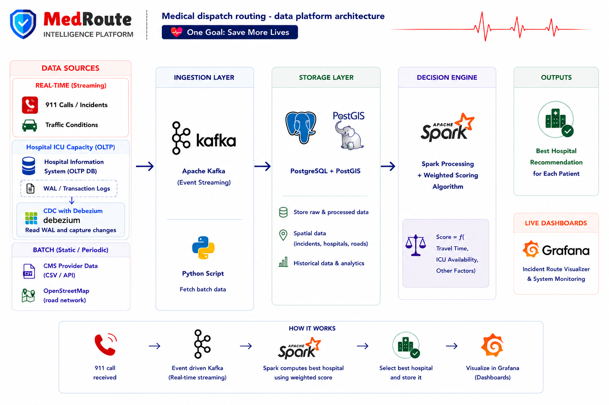
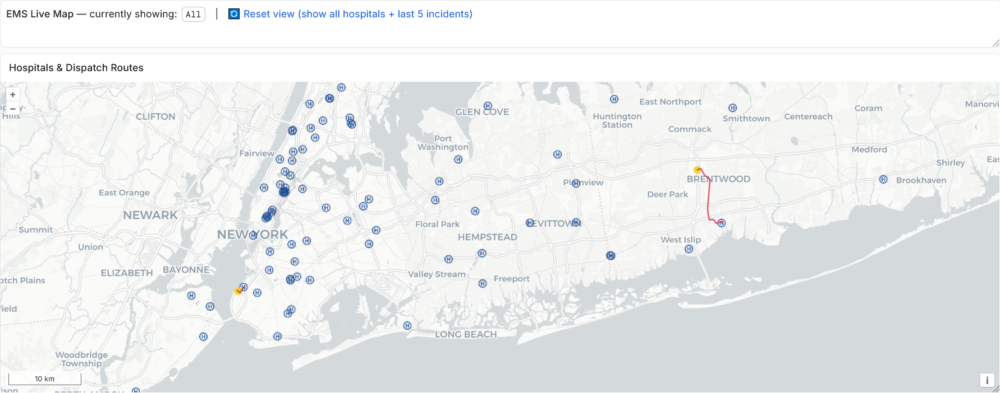

# MedRoute Intelligence Platform

## Table of Contents
- [Overview](#overview)
- [Architecture](#architecture)
- [Data Sources](#data-sources)
- [Layer-by-Layer Breakdown](#layer-by-layer-breakdown)
  - [1. Ingestion Layer](#1-ingestion-layer)
  - [2. Storage & Transformation Layer](#2-storage--transformation-layer)
  - [3. Decision Engine](#3-decision-engine)
  - [4. Product & Dashboards](#4-product--dashboards)
- [Tech Stack](#tech-stack)
- [Data Flow](#data-flow)
- [Project Structure](#project-structure)
- [Getting Started](#getting-started)

---

## Overview

When a 911 call comes in, every second matters. MedRoute is a real-time data platform that continuously ingests hospital ICU capacity, static traffic conditions, and active incident data — then uses a weighted scoring algorithm to recommend the best hospital for each patient, considering travel time and bed availability.

The platform is built on a modern event-driven data stack that separates concerns clearly: raw streaming ingestion via Apache Kafka, a storage layer powered by Postgres, a Spark-powered decision engine, and live Grafana dashboards for incident route visualization and system monitoring.


## Architecture




## Data Sources

### Batch & Static Reference Data

| Source | Format | Purpose |
| --- | --- | --- |
| HIFLD Open | GeoJSON | Geographic boundaries and facility coordinates |
| OpenStreetMap | PBF / GeoJSON | Static road network graph for routing calculations |

### Streaming — Real-time

| Source | Type | Kafka topic | Description |
| --- | --- | --- | --- |
| Incident Simulator | Producer | `incident_stream` | Simulates incoming 911 calls with real-time location and severity data |
| Hospital Capacity Stream | Producer | `hospital_icu_capacity` | Streams real-time updates of available ICU and ER beds using CDC via Debezium |
| 


## Layer-by-Layer Breakdown

### 1. Ingestion Layer

**Batch Ingestion — Python Core**

A set of robust Python utility scripts handles the extraction and parsing of all static reference datasets (OSM road networks and hospital registries). The data is loaded directly into the Postgres storage engine as historical context.

**Streaming Ingestion — Apache Kafka**

Real-time operational events are handled by a distributed message broker across two dedicated Kafka topics:

- `incident_stream`: Dispatches JSON payloads for every newly reported emergency incident.
- `hospital_icu_capacity`: Streams instant shifts in hospital resource availability.

**Kafka Consumers**

Lightweight, decoupled Python consumers continuously listen to the active Kafka topics, parsing incoming JSON streams and committing them instantly into the Postgres storage subsystem with minimal ingestion latency.

---

### 2. Storage & Transformation Layer

All data streams and static lookup files flow into **Postgres** to benefit from PostGIS functionality which enables geospatial queries and routing calculations.

---

### 3. Decision Engine

The core computational engine is triggered immediately when a new record enters the active incidents log.

**Apache Spark — Real-time Distributed Triage & Matrix Routing**

Apache Spark acts as the central brain of the platform. It consumes the incoming streaming logs and runs high-performance Vectorized Worker Iterators via mapInPandas across all candidate hospitals within the immediate perimeter of the incident:

- Spatial Proximity: Filters and indexes the nearest 5 hospitals within a 30km perimeter via PostGIS spatial KNN lookups.

- Real-time Traffic Routing: Dispatches geographic coordinates to Valhalla's matrix engine to calculate concurrent travel times using live traffic telemetry.

- Resource Constraints: Enforces strict bed capacity thresholds dynamically mapped to the incident's severity level, with a safety fallback to the fastest facility.

Spark isolates the optimal hospital destination that satisfies the resource constraints, generates a map-ready GeoJSON path, and coordinates transaction boundaries across a decoupled multi-sink grid—streaming successful dispatches to PostgreSQL and Redpanda, while routing capacity or engine failures into a dedicated Dead Letter Queue (DLQ).

---

### 4. Product & Dashboards

#### Grafana Operator Dashboard

The front-end operational interface is powered by Grafana, querying Postgres analytics tables natively.

- **Accident Route Visualizer:** Displays active accident locations mapped alongside the calculated optimal paths to recommended treatment facilities.



#### Twilio SMS Notifications
Alert hospital staff and emergency responders with real-time routing recommendations via Twilio SMS API integration.


## Tech Stack

| Tool | Role | Focus Area |
| :--- | :--- | :--- |
| **Apache Kafka** | Distributed Message Broker | Real-time event streaming and ingestion decoupling |
| **Python** | System Scripting & Consumers | Ingestion orchestration and simulator components |
| **Postgres** | Relational Database | Persistent storage for incident and hospital data |
| **Apache Spark** | Distributed Compute Engine | Executing the real-time weighted hospital scoring matrix |
| **Debezium** | Change Data Capture | Streaming Postgres changes to Kafka topics |
| **Valhalla** | Routing Engine | Open-source routing engine for travel time estimation |
| **Grafana** | Operational Visualization | Interactive routing dashboards and infrastructure metrics |
| **Docker** | Component Containerization | Unified local deployment and microservice sandboxing |


## Project Structure

```text
medroute-intelligence-platform/
│
├── config/                             # Infrastructure and service configurations
│   ├── hifld-connector.json            # Debezium/Kafka connector settings for CDC
│   └── postgresql.conf                 # Performance tuning configuration for PostgreSQL
│
├── data/                               # Local persistent storage or volume mounts
│
├── grafana/                            # Metrics and routing visualizations
│   ├── routes.json                     # Main map dashboard panel export
│   └── routes.png                      # Dashboard UI preview screenshot
│
├── scripts/                            # Operational management scripts
│
├── src/                                # Main application source code
│   │
│   ├── decision_engine/                # Real-time processing and pipeline brain
│   │   ├── Checkpoints/                # Spark structured streaming checkpoint metadata
│   │   ├── dispatch_engine.py          # Core Spark stream (mapInPandas & routing logic)
│   │   ├── hospitals_cdc_to_olap.py    # CDC ingestion pipeline handling hospital updates
│   │   ├── Dockerfile                  # Container definition for the Spark cluster worker
│   │   └── requirements.txt            # Python dependencies for the core engine
│   │
│   └── simulators/                     # Simulation cluster for real-time data streaming
│       │
│       ├── hospitals/                  # ICU bed drift and state changes simulator
│       │   ├── data/                   # Hospital location seed data
│       │   ├── cdc_config.sql          # SQL scripts setting up transactional logging/CDC
│       │   ├── icu_sim.py              # Generator triggering dynamic hospital bed drift
│       │   ├── Dockerfile              
│       │   └── requirements.txt        
│       │
│       ├── incident/                   # Emergency events generator
│       │   ├── accidents.csv           # Historical spatial accident database
│       │   ├── incident_simulator.py   # High-velocity producer streaming incidents to Redpanda
│       │   ├── Dockerfile               
│       │   └── requirements.txt        
│       │
│       └── traffic/                    # Dynamic routing map engine
│           ├── fetch_and_build.py      # Automates OpenStreetMap ingestion and graph compilation
│           └── Dockerfile.traffic      
│
├── .gitignore                          
├── docker-compose.yml                  
└── README.md                           
```

## Getting Started

1. Clone the repository:
    ```bash
    git clone medroute-intelligence-platform.git
    cd medroute-intelligence-platform 
    ```

2. You need to down load the OpenStreetMap PBF file for your region of interest then set up Valhall engine to build the routing graph. 

3. Upload the HIFLD hospital registry and OpenStreetMap road network data into Postgres (I used QGIS tool as a shortcut).

4. Start the platform using Docker Compose:
    ```bash
    docker compose up -d
    ```

5. Open the Control Center

    Navigate to `http://localhost:3000` to access the Grafana Route Analytics board (Default: `admin / admin`).

## Improvements & Future Work
- Use **live traffic** data from Google Maps or HERE API to improve routing accuracy.
- **Injury type classification**: add a ML classifier that reads incident description and tags it (cardiac, trauma, stroke) to match hospital specialties better


**Built with ❤️ by Ali Adel**